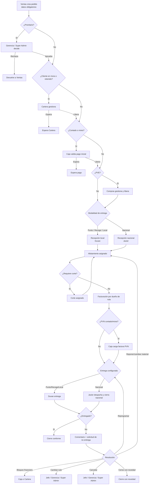

# EI ERP Nova V8 — Arquitectura por roles

## Principios implementados

- Cada rol operativo ve solamente su bandeja, comentarios y acciones necesarias para avanzar.
- Facturación y entrega pertenecen al dueño de la ruta: Duvan para local y Javier para nacional.
- `aux_logistica` solo alista pedidos asignados.
- `auxiliar_corte` solo ejecuta cortes asignados y prealistamiento controlado.
- Gerencia, Jefe de logística y Auditoría son perfiles de supervisión; no operan pedidos.
- Gerencia es aprobador transversal de solicitudes formales, sin convertirse en operador.
- Las cancelaciones solo pueden aprobarlas Jefe de logística, Gerencia o Super Admin.
- Las novedades ordinarias son comentarios dentro del pedido.
- Caja tiene dos intervenciones distintas: control inicial de contado/mixto y carga posterior de factura únicamente para PVN contado/mixto.
- Cartera gestiona mora, retenciones y solicitudes de crédito.
- PVE siempre pasa por Compras.
- Toda regla se valida tanto en interfaz como en RPC/RLS.

## Flujo principal

## Solicitudes formales

Solo se abre una solicitud cuando la novedad pretende modificar el flujo o una condición controlada:

1. prioridad;
2. cancelación;
3. cambio de modalidad de entrega;
4. excepción de inventario o remanente;
5. excepción de flujo;
6. reapertura;
7. corrección de datos;
8. excepción financiera;
9. no entrega.

El usuario operativo solicita desde el pedido. La bandeja muestra únicamente solicitudes creadas por el usuario, asignadas a su UID o asignadas a su rol. Auditoría puede consultar; no decide.

## Fuentes de verdad

- Roles y módulos: `apps/trazabilidad/config/operating-model.json`.
- Transiciones normales: `engine/shared/json/flow-contract.json`.
- Excepciones y devoluciones: `engine/shared/json/exception-contract.json`.
- Autorización de cliente: `engine/shared/js/role-policy.js`.
- Autorización definitiva: `supabase/sql/05_REESTRUCTURAR_ROLES_Y_FLUJO_V8.sql`.

## Instalación

1. Subir el parche V8 conservando las rutas.
2. Ejecutar `supabase/sql/05_REESTRUCTURAR_ROLES_Y_FLUJO_V8.sql` en Supabase.
3. Confirmar los roles migrados: Javier=`despacho_nacional`, Duvan=`coordinador_logistico`, Andrés Mendoza=`recepcion_mercancia`.
4. Limpiar caché, service worker y sesión anterior.
5. Ingresar como Super Admin y ejecutar el diagnóstico integral.
6. Ejecutar el bot E2E con cuentas reales por rol antes de certificar producción.

